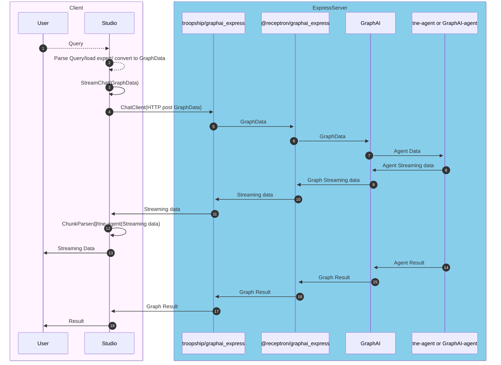

# Flow of data when a user query is entered in studio and processed by the server

Data Flow

- Server

  - Node express server
    - Consists of the following two components
      - [troopship/graphai_express](https://github.com/TNE-ai/troopship/blob/main/graphai_express/src/express.ts) (Express server)
      - [@receptron/graphai_express](https://www.npmjs.com/package/@receptron/graphai_express) (Express server middleware)
    - [graphRunner](https://github.com/receptron/graphai-utils/blob/main/packages/express/src/graph.ts)
  - Agent
    - Use GraphAI Standard agents and TNE custom agents.
      - [tne-agent](https://github.com/TNE-ai/troopship/tree/main/tne-agent)
      - [@graphai/llm_agents](https://www.npmjs.com/package/@graphai/llm_agents) / [@graphai/agents](https://www.npmjs.com/package/@graphai/agents)

- Client(Studio)
  - streamingChat ([studio/src/libs/graphStreaming.ts](https://github.com/TNE-ai/troopship/blob/main/studio/src/libs/graphStreaming.ts))
    - http client handle http streaming
  - streamClient ([studio/src/libs/graphChatMessage.ts](https://github.com/TNE-ai/troopship/blob/main/studio/src/libs/graphChatMessage.ts))
    - Convert data from response of GraphAI agent to studio data
  - ChunkParser ([tne-agent/src/chunk_parser.ts](https://github.com/TNE-ai/troopship/blob/main/tne-agent/src/chunk_parser.ts))
    - http streamingのchunk parser
- Agent
  - Http Stream
    - Stream the data in the following part using agent filter
      - filterParams.streamTokenCallback
